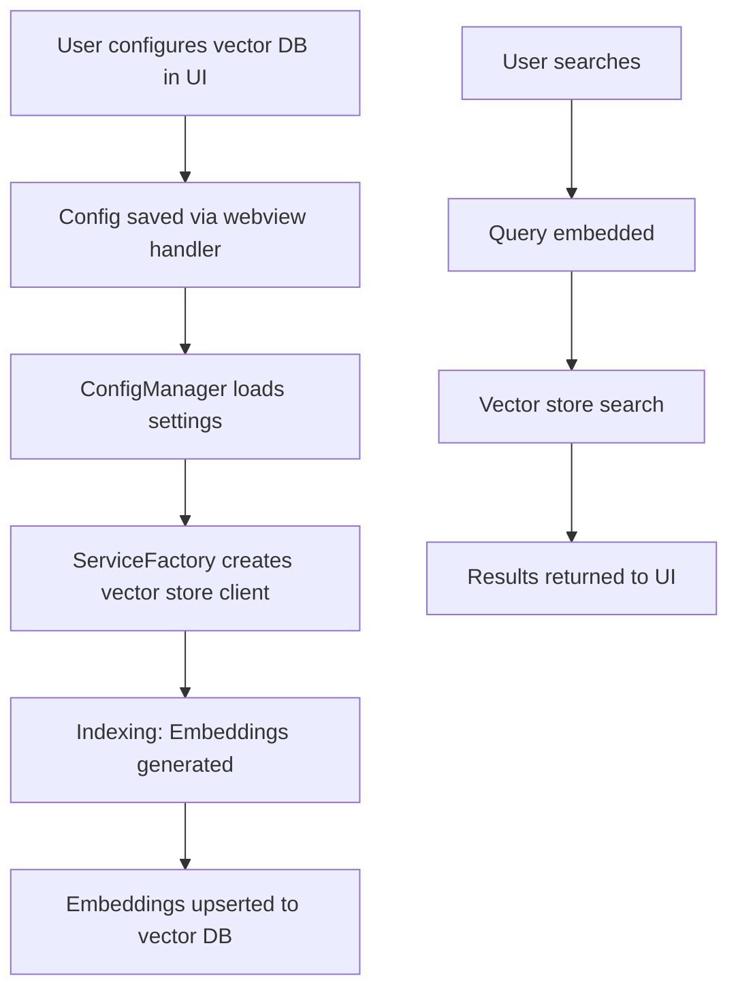

# Vector Database Integration for Codebase Indexing

This document explains how the vector database (vector DB) integration works for the codebase indexing feature, details the pipeline, lists all involved files, and provides guidance for adding support for a new vector DB.

---

## 1. Pipeline Overview

### A. Configuration

- Users configure the codebase indexing feature via the settings UI, selecting the vector store type (e.g., Qdrant, Faiss, Chroma) and providing the URL/API key.
- Configuration is handled and persisted in the backend.
- **Main files/functions:**
    - UI: [`CodeIndexSettings`](../webview-ui/src/components/settings/CodeIndexSettings.tsx)
    - Webview handler: [`webviewMessageHandler` ("codebaseIndexConfig" case)](../src/core/webview/webviewMessageHandler.ts)
    - Config manager: [`CodeIndexConfigManager._loadAndSetConfiguration`](../src/services/code-index/config-manager.ts)

### B. Service Initialization

- The [`CodeIndexManager`](../src/services/code-index/manager.ts) orchestrates the indexing process.
- It uses [`CodeIndexServiceFactory`](../src/services/code-index/service-factory.ts) to create the appropriate vector store client based on the configuration.
- The factory checks the `vectorStoreType` and instantiates the corresponding class (e.g., [`QdrantVectorStore`](../src/services/code-index/vector-store/qdrant-client.ts)).
- **Main files/functions:**
    - [`CodeIndexManager.initialize`](../src/services/code-index/manager.ts)
    - [`CodeIndexServiceFactory.createVectorStore`](../src/services/code-index/service-factory.ts)

### C. Indexing

- The codebase is scanned, and code chunks are embedded using the selected embedder (OpenAI, Ollama, etc.).
- Embeddings and metadata are upserted into the vector store via the [`IVectorStore`](../src/services/code-index/interfaces/vector-store.ts) interface.
- **Main files/functions:**
    - [`CodeIndexManager.startIndexing`](../src/services/code-index/manager.ts)
    - [`IVectorStore.upsertPoints`](../src/services/code-index/interfaces/vector-store.ts) (implemented by e.g. [`QdrantVectorStore.upsertPoints`](../src/services/code-index/vector-store/qdrant-client.ts))

### D. Search

- When a search is performed, the query is embedded, and the vector is sent to the vector store's `search` method.
- Results are filtered and returned to the UI.
- **Main files/functions:**
    - [`CodeIndexManager.searchIndex`](../src/services/code-index/manager.ts)
    - [`CodeIndexSearchService.searchIndex`](../src/services/code-index/search-service.ts)
    - [`IVectorStore.search`](../src/services/code-index/interfaces/vector-store.ts) (implemented by e.g. [`QdrantVectorStore.search`](../src/services/code-index/vector-store/qdrant-client.ts))

---

## 2. Key Files Involved

| File/Directory                                             | Purpose                                                             |
| ---------------------------------------------------------- | ------------------------------------------------------------------- |
| `src/services/code-index/interfaces/vector-store.ts`       | Defines the `IVectorStore` interface (contract for all vector DBs). |
| `src/services/code-index/vector-store/qdrant-client.ts`    | Qdrant implementation of `IVectorStore`.                            |
| `src/services/code-index/vector-store/faiss-client.ts`     | (Stub) Faiss implementation.                                        |
| `src/services/code-index/service-factory.ts`               | Factory for creating the correct vector store based on config.      |
| `src/services/code-index/config-manager.ts`                | Loads and manages vector store configuration.                       |
| `src/services/code-index/interfaces/config.ts`             | Defines config structure for vector store settings.                 |
| `webview-ui/src/components/settings/CodeIndexSettings.tsx` | UI for selecting/configuring vector store.                          |
| `src/core/webview/webviewMessageHandler.ts`                | Handles config changes from the UI.                                 |
| `src/services/code-index/manager.ts`                       | Main manager for indexing/searching.                                |
| `src/services/code-index/search-service.ts`                | Handles search logic using the vector store.                        |

---

## 3. Adding a New Vector DB Integration

Suppose you want to add support for a new vector DB (e.g., Pinecone, Milvus):

### A. Implement the Interface

- Create a new file, e.g., `src/services/code-index/vector-store/pinecone-client.ts`.
- Implement the `IVectorStore` interface from `interfaces/vector-store.ts`.
    - Required methods: `initialize`, `upsertPoints`, `search`, `deletePointsByFilePath`, `deletePointsByMultipleFilePaths`, `clearCollection`, `deleteCollection`, `collectionExists`.

### B. Update the Factory

- In `src/services/code-index/service-factory.ts`, add a new case in `createVectorStore()` for your vector DB:
    ```ts
    if (config.vectorStoreType === "pinecone") {
    	return new PineconeVectorStore(this.workspacePath, config.vectorStoreUrl, vectorSize, config.vectorStoreApiKey)
    }
    ```

### C. Update Types and Config

- Add `"pinecone"` to the allowed values in:
    - `codebaseIndexConfigSchema` in `packages/types/src/codebase-index.ts`
    - `CodeIndexConfig` in `src/services/code-index/interfaces/config.ts`
- Update the UI dropdown in `CodeIndexSettings.tsx` to include your new vector DB.

<!-- ### D. (Optional) Add UI/Settings
- If your vector DB requires special settings, add fields to the settings UI and handle them in the config manager. -->

---

## 4. Pipeline Diagram



---

## 5. Extensibility Notes

- The system is designed to be extensible: all vector DBs must implement the `IVectorStore` interface.
- The factory pattern in `service-factory.ts` makes it easy to add new vector DBs.
- The UI and config schema must be updated to expose new options to users.

---

## 6. References

- See the files listed above for implementation details and examples.
